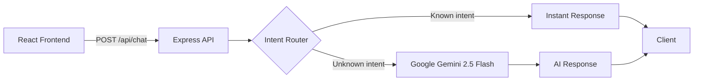

<p align="center">
  <strong>⚽ GAFFER AI</strong>
</p>

<p align="center">
  <em>Your AI-Powered Smart Stadium Assistant — Built for the Google Build with AI Hackathon</em>
</p>

<p align="center">
  
  
  
  
  
</p>

---

## 🎯 What is Gaffer AI?

Gaffer AI is an **AI-powered matchday assistant** that helps football fans navigate stadiums, find food, locate gates and seats, get parking info, and enjoy a stress-free matchday experience — all through natural conversation powered by **Google Gemini**.

### The Problem

- Fans struggle to find seats, gates, and facilities inside large stadiums
- No centralized tool for food, parking, and matchday information
- Existing apps don't use AI for personalised, contextual help

### The Solution

Gaffer AI combines **smart intent routing** with **generative AI** to provide instant, contextual stadium assistance. Common queries (gates, food, parking, emergencies) are handled instantly, while complex questions are routed to Gemini for natural language responses.

---

## ✨ Core Features

| Feature | Description |
|---|---|
| 🤖 **AI Chat** | Natural language matchday assistant powered by Google Gemini 2.5 Flash |
| 🧭 **Stadium Navigation** | Find gates, seats, and facilities |
| 🍔 **Food & Beverage** | Discover nearby food stalls and dining options |
| 🅿️ **Parking Info** | Locate parking zones and get directions |
| 🚨 **Emergency Support** | Quick access to safety information and first-aid locations |
| 📊 **Live Match Center** | Score, stats, and stadium intelligence dashboard |
| ⚡ **Smart Intent Routing** | Instant responses for common queries without API calls |

---

# Gaffer AI ⚽

🚀 Live Demo:
https://gaffer-ai-xi.vercel.app

Backend API:
https://gafferai.onrender.com

## 🏗️ Architecture



**How it works:**
1. User types a message in the chat interface
2. The backend's **intent router** checks for common stadium queries (gates, food, parking, emergencies)
3. If matched → returns an **instant response** (zero API cost)
4. If unmatched → forwards to **Google Gemini** with a stadium-specific system prompt
5. Response is sanitised and returned to the client

---

## 🛠️ Tech Stack

| Layer | Technology | Version |
|---|---|---|
| **Frontend** | React | 19.2 |
| **Build Tool** | Vite | 8.1 |
| **Styling** | Tailwind CSS | 4.3 |
| **Animations** | Framer Motion | 12.42 |
| **Icons** | Lucide React | 1.24 |
| **Backend** | Express.js | 5.2 |
| **AI** | Google Gemini (via @google/genai) | 2.11 |
| **Security** | Helmet, express-rate-limit, CORS | Latest |
| **Testing** | Vitest, Supertest, React Testing Library | Latest |
| **Deployment** | Render | — |

---

## 🚀 Getting Started

### Prerequisites

- **Node.js** ≥ 18
- **npm** ≥ 9
- A **Google Gemini API key** ([Get one here](https://aistudio.google.com/apikey))

### Installation

```bash
# Clone the repository
git clone https://github.com/your-username/gaffer-ai.git
cd gaffer-ai

# Install backend dependencies
cd server
npm install

# Install frontend dependencies
cd ../client
npm install
```


### Running Locally

```bash
# Terminal 1 — Start the backend
cd server
npm run dev

# Terminal 2 — Start the frontend
cd client
npm run dev
```

The frontend runs at `http://localhost:5173` and the API at `http://localhost:5000`.

---

## 📡 API Documentation

### `POST /api/chat`

Send a message to the AI assistant.

**Request:**
```json
{
  "message": "Where is gate B?"
}
```

**Response (200):**
```json
{
  "success": true,
  "data": {
    "reply": "I can help you navigate inside the stadium. Please share your gate number or ticket section to get the best route."
  }
}
```

**Error Responses:**
| Status | Condition |
|---|---|
| 400 | Message missing, empty, non-string, or >500 chars |
| 429 | Rate limit exceeded (30 req/min) |
| 500 | Internal server error |

### `GET /api/status`

Health check endpoint.

**Response (200):**
```json
{
  "status": "success",
  "message": "Hello from Gaffer Backend!"
}
```

---

## 🧪 Testing

```bash
# Run backend tests
cd server
npm test

# Run frontend tests
cd client
npm test
```

### Test Coverage

| Area | Tests |
|---|---|
| **Backend API** | Input validation, intent routing, health endpoints |
| **Intent Router** | All 5 intent categories + case insensitivity |
| **Security** | Helmet headers, CORS, rate limiting, payload limits |
| **Components** | ChatMessages, Footer, App rendering |
| **Hooks** | useChat state management and error handling |
| **API Service** | Success/error responses, input validation |

---

## 🔒 Security Features

- **Helmet** — Sets secure HTTP headers (X-Content-Type-Options, CSP, X-Frame-Options, etc.)
- **Rate Limiting** — 30 requests per minute per IP on all `/api` routes
- **CORS** — Restricted to the frontend origin in production
- **Input Validation** — Type checking, length limits (500 chars), whitespace trimming
- **Body Size Limit** — Express JSON parser limited to 1KB payloads
- **System Prompt Isolation** — Gemini `systemInstruction` field prevents prompt injection
- **Output Sanitisation** — HTML tags stripped from AI responses
- **Environment Variables** — API keys stored in `.env`, never committed to git

---

## ♿ Accessibility

- **Skip-to-content** link for keyboard users
- **ARIA labels** on all interactive elements (navigation, chat input, buttons)
- **`aria-live="polite"`** on chat messages for screen reader announcements
- **`aria-expanded`** on mobile menu toggle
- **Semantic HTML** — `<main>`, `<nav>`, `<footer>`, `<article>`, `role="log"`
- **`<noscript>`** fallback for non-JavaScript browsers
- **Focus states** on all interactive elements
- **Error boundary** for graceful error recovery

---

## 📁 Folder Structure

```
gaffer/
├── README.md
├── client/                    # React frontend
│   ├── index.html
│   ├── package.json
│   ├── vite.config.js
│   ├── .env.example
│   ├── public/
│   │   ├── favicon.svg
│   │   └── icons.svg
│   └── src/
│       ├── App.jsx            # Root component with ErrorBoundary
│       ├── main.jsx           # Entry point
│       ├── index.css           # Tailwind + custom styles
│       ├── assets/            # Images, logos, icons
│       ├── components/        # Reusable UI components
│       │   ├── chat/          # Chat-specific components
│       │   ├── common/        # Shared components (Logo)
│       │   ├── ErrorBoundary.jsx
│       │   ├── Navbar.jsx
│       │   ├── Footer.jsx
│       │   └── ...
│       ├── hooks/             # Custom React hooks
│       │   └── useChat.js
│       ├── pages/             # Page components
│       │   └── Home.jsx
│       ├── services/          # API service layer
│       │   └── api.js
│       └── tests/             # Test files
│           ├── setup.js
│           ├── App.test.jsx
│           ├── ChatMessages.test.jsx
│           ├── useChat.test.js
│           ├── api.test.js
│           └── Footer.test.jsx
└── server/                    # Express backend
    ├── index.js               # Server entry with security middleware
    ├── package.json
    ├── .env.example
    ├── routes/
    │   └── chat.js            # Chat API route with validation
    ├── services/
    │   ├── gemini.js          # Gemini API integration
    │   └── intentRouter.js    # Keyword-based intent matching
    └── tests/
        ├── chat.test.js       # API endpoint tests
        ├── intentRouter.test.js  # Intent matching tests
        └── security.test.js   # Security verification tests
```

---

## 🚢 Deployment

Deployed on **Render** as two separate services:

| Service | Type | URL |
|---|---|---|
| Frontend | Static Site | `npm run build` → `dist/` |
| Backend | Web Service | `npm start` |


---

## 🔮 Future Scope

- Real-time match data integration via sports APIs
- User authentication and personalised matchday history
- Push notifications for gate changes and delays
- Multi-stadium support with venue-specific data
- Offline mode with cached stadium maps
- Multi-language support

---

## 👤 Author

**Aayushi** — Built with ❤️ for the **Google Build with AI — Prompt Wars Virtual Hackathon**

---

## 📄 License

ISC
